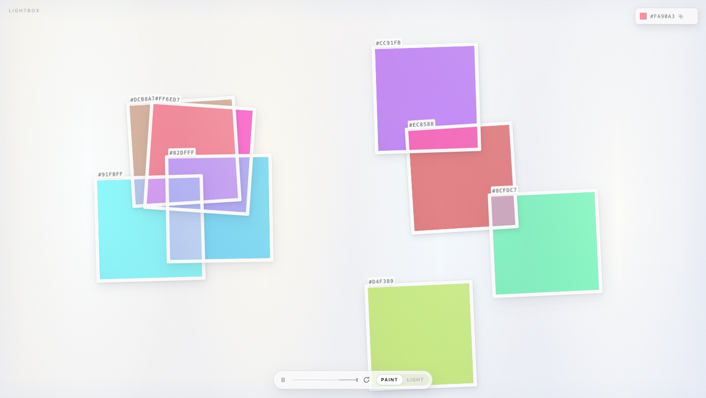

# Lightbox

Eight sheets of transparent coloured film drifting over a backlit surface. Where they
cross you get a third colour that nobody chose. That colour is the point.

**[Open Lightbox](https://mohsenny.github.io/whoami/lightbox/)**



## What it is

Not a palette generator. There is no "generate" button that hands you five swatches
and a name. Lightbox is closer to a light table with coloured gels on it: the sheets
move on their own, they slide over each other, and you watch for a combination worth
keeping. When you see one, you take it.

It is for the moment before you have a palette. Put it on a second screen, glance at
it, and pull colours out when something lands.

## How to use it

**Watch first.** Everything moves on its own. Give it a few seconds. Leave it alone for
three seconds and the controls step aside until you move again.

| You want to | Do this |
| --- | --- |
| Stop one sheet | Click it. It freezes where it is, everything else keeps moving |
| Put a sheet somewhere | Drag it |
| Resize a sheet | Drag the corner grip |
| Keep a colour | Double-click anywhere on the film. The colour under your pointer is saved to the top right, including the mixed colour where sheets cross |
| Copy a hex | Click the copy icon on a sheet's tab, or the swatch next to a saved colour |
| Drop a saved colour | Click the x at the end of its row |
| Hold a colour still | Click the pin on a sheet's tab. Colours drift slowly over time, and a pinned one stops drifting |
| Stop everything | Press <kbd>Space</kbd> |
| Go back a few seconds | Drag the timeline in the dock. It holds the last 15 seconds and replays them exactly |
| Start over | Press <kbd>R</kbd>, or the refresh icon in the dock. Pinned sheets keep their colour |
| Change the mixing | <kbd>B</kbd>, or the Paint / Light switch |
| Save a picture | The arrow in the dock. The film as it is, without the tabs and controls, as a PNG |

**Paint vs Light.** Two answers to the same question, and only the crossings change.
Paint mixes the sheets the way pigment mixes: blue over yellow gives green, and a
fourth layer costs no brightness, so busy corners stay readable. Light is the optics:
the light that actually survives both sheets, which is richer and darker, and turns a
complementary crossing to mud exactly the way real gels do.

**Every session has an address.** The URL carries a seed, so reloading gives you the
same eight colours you opened with, and sharing the link gives someone else the same
starting set.

### Keyboard

<kbd>Space</kbd> play / pause. <kbd>R</kbd> new colours. <kbd>B</kbd> switch mixing.
<kbd>Esc</kbd> deselect. <kbd>Tab</kbd> walks the sheets, then <kbd>Enter</kbd> to
stop one, <kbd>C</kbd> to copy it, <kbd>L</kbd> to pin it, arrow keys to resize.

## How it works

Colours are chosen in OKLCH along a hue skeleton, so the eight are spread perceptually
rather than numerically. There is no list of hand-picked palettes in here, and a roll
that puts two sheets too close together to tell apart is rejected and re-rolled.

Overlaps are derived, not decorated. The painter works out every region the sheets
carve out of each other and colours each one from the exact set of sheets covering it,
then multiplies the whole thing over the lit surface. Nobody picked the crossing
colours, which is why they are worth looking at.

The motion is a deterministic simulation running outside React. Every frame is written
to a ring buffer, which is why the timeline scrubs to a real past frame instead of
playing the animation backwards.

More on all of it in [docs/design-notes.md](docs/design-notes.md).

## Gravity

**[Open Gravity](https://mohsenny.github.io/whoami/gravity/)**, the sibling instrument: a
net of space pulled in by a mass, with probes and light moving through it. Same
surface, same chrome. The names in the top-left corner cross between the instruments.
Its source is in [gravity/](gravity/) and what it does and why is in
[gravity/PRD.md](gravity/PRD.md). It was called Lattice until October 2026.

## Solar

**[Open Solar](https://mohsenny.github.io/whoami/solar/)**, the third: the Sun, the
planets and Pluto, the Moon and 44 moons of Mars, the four giants and Pluto where they
really are, at their true sizes and distances. Become any of them and click the others to
see them from there, run the clock either way through the Sun's whole life, and step from
eclipse to eclipse. Same chrome with the lights out. Its source is in [solar/](solar/) and
the why is in [solar/PRD.md](solar/PRD.md).

Its planet and Moon maps are by
[Solar System Scope](https://www.solarsystemscope.com/textures/) (CC BY 4.0), the round
moons of the four giants are NASA, JPL and USGS mosaics, Pluto and Charon are New
Horizons mosaics (NASA, JHUAPL, SwRI) and the stars are the Yale Bright Star Catalogue.
The small moons show as plain colours on their real shapes: P.C. Thomas's (Cassini, PDS)
for Saturn's, R.W. Gaskell's for Phoebe, C.M. Ernst's (JHU APL) for Phobos and Deimos and
P.J. Stooke's for Amalthea, Thebe and Proteus.

## Mohsen

**[The site's front page](https://mohsenny.github.io/whoami/)** is my CV: my life laid out
as sheets of the same film, with the CV as text one press away. Its source is in
[cv/](cv/). The logos on it are their owners' trademarks; [cv/logos.md](cv/logos.md) says
where each came from.

## Running it locally

```sh
npm install
npm run dev
```

Then open the URL it prints, which opens on the CV. Other scripts: `npm run build`,
`npm test`, `npm run lint`, `npm run typecheck`.

React, TypeScript and Vite. No runtime dependencies beyond React itself, except
Astronomy Engine for Solar's ephemeris. Pushing to `main` builds and deploys to GitHub
Pages.
